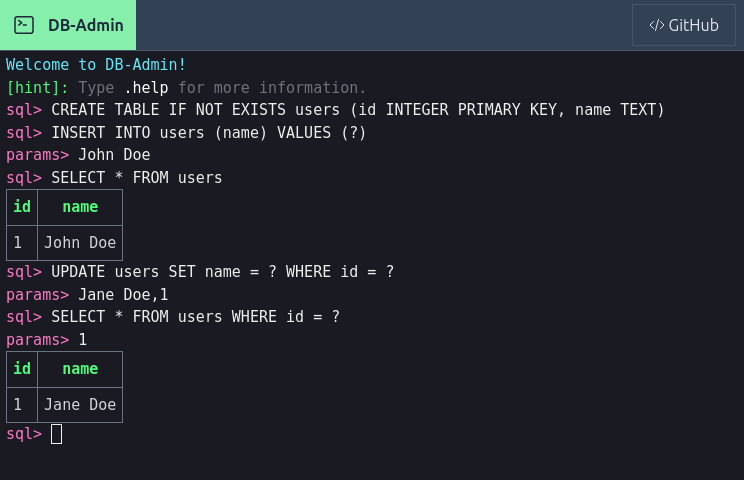

<div align=center>


# DB-Admin



</div>

## Overview

DB-Admin is an experimental project that allows users to interact with databases directly in their web browsers. It provides an intuitive and user-friendly command-line interface for querying, and managing databases without the need for external database clients. It takes SQL queries as input, posts it to the server and displays the result of the executed query.

## Key Features

- [x] **Browser-Based Database Access**

  Access and interact with databases directly from your web browser, eliminating the need for external database management tools.

- [x] **Supported Databases**

  Initially supports SQLite and MySQL, with plans to expand support for other databases like PostgreSQL in future releases.

- [ ] **Security Features** - _work in progress_
  Employ security measures to prevent SQL injection and ensure secure interactions with the database.


## Disclaimer

DB-Admin is an experimental project and may not be suitable for production use. Use it at your own risk, and always back up your data before performing critical operations.

## Getting Started

Before you get started, be sure that you have one of the supported database already installed otherwise install one.

**Supported Databases**:

- MySQL
- SQLite3

**Preresquities**:

- [NodeJS](https://nodejs.org) and [npm](https://npmjs.org)

Follow the steps below to setup a demo on your machine

1. Clone this repository and navigate to it

   ```sh
   git clone https://github.com/henryhale/db-admin.git
   cd db-admin
   ```

2. Install all necessary dependencies

   ```sh
   npm install
   # pnpm install
   ```

3. Choose a database (MySQL or SQLite3)

   In case of MySQL, make sure that you have installed it already on your machine.

   In case of SQLite3, the npm package, `sqlite3` sets up the database locally, on your machine.

   Additionally dependencies are required for setting up the connection to the choosen database.

   For MySQL, install `mysql2` libray

   ```sh
   npm install mysql2
   # pnpm add mysql2
   ```

   For SQLite3, install `sqlite3` library

   ```sh
   npm install sqlite3
   # pnpm add sqlite3
   ```

4. Create `.env` file at the root of the project

   Grab the environment variables from the `.env.sample` file basing on your database choice and create your `.env` file with those contents uncommented. Fill them up as per your database server.

   For example:

   MySQL: `.env` file contents

   ```
   DB_TYPE=mysql
   DB_HOST=localhost
   DB_PORT=
   DB_USER=root
   DB_PASSWORD=
   DB_DATABASE=test
   ```

   SQLite3: `.env` file contents

   ```
   DB_TYPE=sqlite3
   DB_DATABASE=test.db
   ```

   Note: Use `DB_DATABASE=":memory:"` for an in-memory sql database with SQLite3 - _good for testing or educational purposes_

5. Start the development server

   This command watches files for changes and restarts the server

   ```sh
   npm run dev
   # pnpm dev
   ```

   TO simply run the server once (no overhead) use

   ```sh
   npm run serve
   # pnpm serve
   ```

6. Open your browser and navigate to `http://localhost:8000` to access DB-Admin web client
7. Test with some SQL queries

   Type `.help` to get help details

   At this point, you can execute SQL queries directly in your browser.

   For example:

   - Create a table

   ```sh
   sql> CREATE TABLE notes (id INTEGER PRIMARY KEY, txt TEXT NOT NULL, ts TIMESTAMP DEFAULT CURRENT_TIMESTAMP);
   ```

   - Insert data

   ```sh
   sql> INSERT INTO notes (txt) VALUES ('hello world')
   ```

   In case of parameterized queries:

   ```sh
   sql> INSERT INTO notes (txt) VALUES (?)
   params> hello world
   ```

   - Retrieve data

   ```sql
   SELECT * FROM notes
   ```

## Development

### File structure

- `client`: folder containing frontend code ([vue 3](https://v3.vuejs.org) + [vite](https://vitejs.dev))
- `server`: folder containing server-side code (expressjs + database)
- `.env.sample`: an example .env file

### Vue 3 + Vite

The frontend uses Vue 3 `<script setup>` SFCs, check out the [script setup docs](https://v3.vuejs.org/api/sfc-script-setup.html#sfc-script-setup) to learn more.

### Recommended IDE Setup

- [VS Code](https://code.visualstudio.com/) + [Volar](https://marketplace.visualstudio.com/items?itemName=Vue.volar) (and disable Vetur) + [TypeScript Vue Plugin (Volar)](https://marketplace.visualstudio.com/items?itemName=Vue.vscode-typescript-vue-plugin).

## Contributing

Contributions are welcome! If you have suggestions or improvements, feel free to open an issue or create a pull request.

## Credits
- XTerminal: [Docs](https://xterminal.js.org)
- Inken: [Repo](https://github.com/henryhale/inken)
- Tailwind CSS: [Docs](https://tailwindcss.com)
- Vue 3: [Docs](https://v3.vuejs.org)
- Vite: [Docs](https://vitejs.dev)
- Expressjs: [Docs](http://expressjs.com/)
- Helmet: [Docs](https://helmetjs.github.io/)
- dotenv: [Repo](https://github.com/motdotla/dotenv)
- mysql2: [Repo](https://github.com/sidorares/node-mysql2/)
- sqlite3: [Repo](https://github.com/TryGhost/node-sqlite3)

## License

Released under [MIT License](./LICENSE.txt)

Copyright &copy; 2023 [Henry Hale](https://github.com/henryhale)

